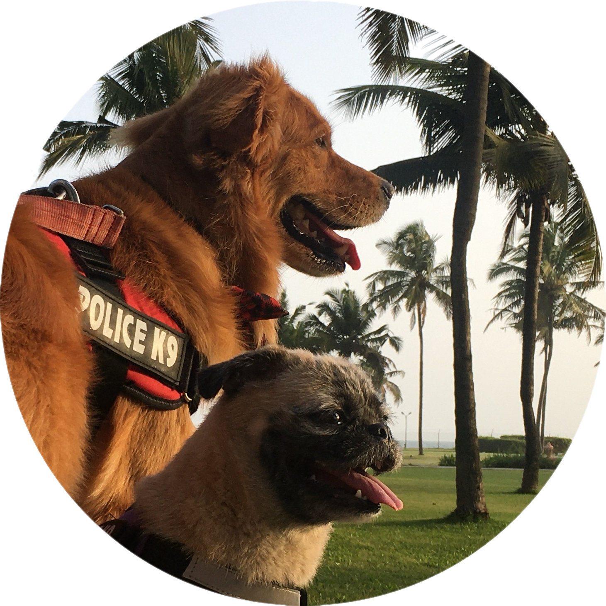

  

<h1 align="center">
  

    hey there
      
  

</h1>

### About Me 
Heyyo, My name's Kunal and I found printing 'Hello World' to the console, pretty cool!
I'm currently in college (IIT Roorkee, India)

Thanks for checking out my profile and have a good day!

---

### My Projects  🌱

-  📱 <a href="https://github.com/kunrex/Scribie.app" target="_blank">An app I made.</a>
-  🤖 <a href="https://github.com/kunrex/Pepper.bot" target="_blank">My discord bot.</a>
-  🚀 <a href="https://github.com/kunrex/neural.net" target="_blank">My neural network</a>
-  ⚙️ <a href="https://github.com/kunrex/ard.blaster" target="_blank">A nerf gun I modded</a>
-  ⚡ <a href="https://github.com/kunrex/llm.net" target="_blank">My transformer (the ML one)</a>
-  🎮 <a href="https://kunrex.itch.io/" target="_blank">A few video games I've worked on.</a>
-  💻 <a href="https://github.com/kunrex/Sugar.lang" target="_blank">A programming language I'm working on.</a>

---

### Languages :interrobang:

  

### Technologies  :hammer_and_wrench:

| Core | Game Dev | Web and App Dev | AI and ML | Arduino and Hardware |
| :-------------: | :-------------:| :-------------: | :-------------: | :-------------: |
|        |    |            |     |   

---

### Competitive Programming :computer:

 

-  <a href="https://github.com/kunrex/Codewars" target="_blank">My codewars katas (the cool ones).</a> 
-  <a href="https://github.com/kunrex/Codeforces" target="_blank">My codeforces solutions (the cool ones).</a>

---

###  My Stats  :fire:

  
  

